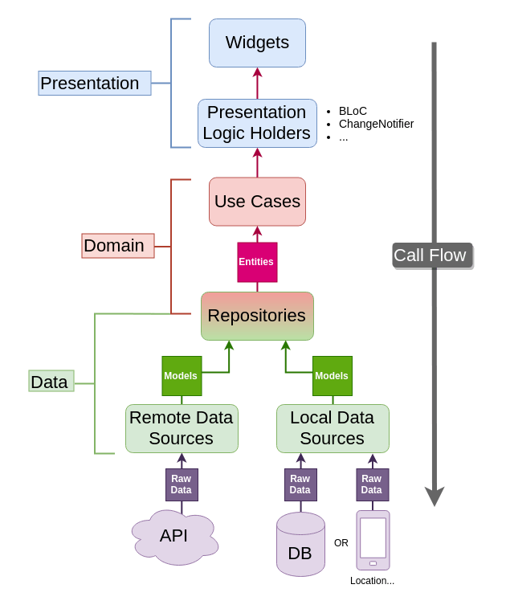

# Flutter projects
Repository full of all kinds of flutter projects

## Projects
### UI Challenges
 - Instagram UI
 - Google Keep UI
 - Facebook Messenger UI
 - Zoom UI
 - Ubereats UI

### State management approaches
 - GetX
 - Riverpod
 - BLoC
 - Provider
 - MobX

### Clean Architecture & TDD
 - TDD

## Clean Architecture Project Structure
```
├─ core/                       
│  ├─ api/                     
│  ├─ errors/                  
│  ├─ network/                 
│  └─ usecases/                
│
├─ features/
│  └─ feature/
│     ├─ data/                       
│     │  ├─ datasources/             
│     │  ├─ models/                   
│     │  └─ repositories             
│     │
│     ├─ domain/                     
│     │  ├─ entities/                
│     │  ├─ repositories/            
│     │  └─ usecases/                
│     │
│     └─ presentation/               
│         ├─ business_logic/          
│         ├─ pages/                   
│         └─ widgets/                 
│   
├─ injection_container.dart    
└─ main.dart
```



## CI / CD

[Offcial Flutter documentation for CI/CD](https://flutter.dev/docs/deployment/cd)

### GitHub Actions

[Flutter Action](https://github.com/marketplace/actions/flutter-action)

`.github/workflows/config.yml`

```
name: CICD
on:
  pull_request:
    branches:
      - master

jobs:
  flutter_test:
    name: Run flutter test and analyze
    runs-on: ubuntu-latest
    steps:
      - uses: actions/checkout@v2
      - uses: actions/setup-java@v1
        with:
          java-version: "12.x"
      - uses: subosito/flutter-action@v1
        with:
          channel: "stable"
      - run: flutter pub get
      - run: flutter analyze
      - run: flutter test

  build_ios:
    name: Build Flutter (iOS)
    needs: [flutter_test]
    runs-on: macos-latest
    steps:
      - uses: actions/checkout@v2
      - uses: actions/setup-java@v1
        with:
          java-version: "12.x"
      - uses: subosito/flutter-action@v1
        with:
          channel: "stable"
      - uses: actions/upload-artifact@master
        with:
          name: ios-build
          path: build/ios/iphoneos
      - run: flutter pub get
      - run: flutter clean
      - run: flutter build ios --release --no-codesign

  build_appbundle:
    name: Build Flutter (Android)
    needs: [flutter_test]
    runs-on: ubuntu-latest
    steps:
      - uses: actions/checkout@v2
      - uses: actions/setup-java@v1
        with:
          java-version: "12.x"
      - uses: subosito/flutter-action@v1
        with:
          channel: "stable"
      - uses: actions/upload-artifact@master
        with:
          name: apk-build
          path: build/app/outputs/apk/release
      - run: flutter pub get
      - run: flutter clean
      - run: flutter build appbundle
```